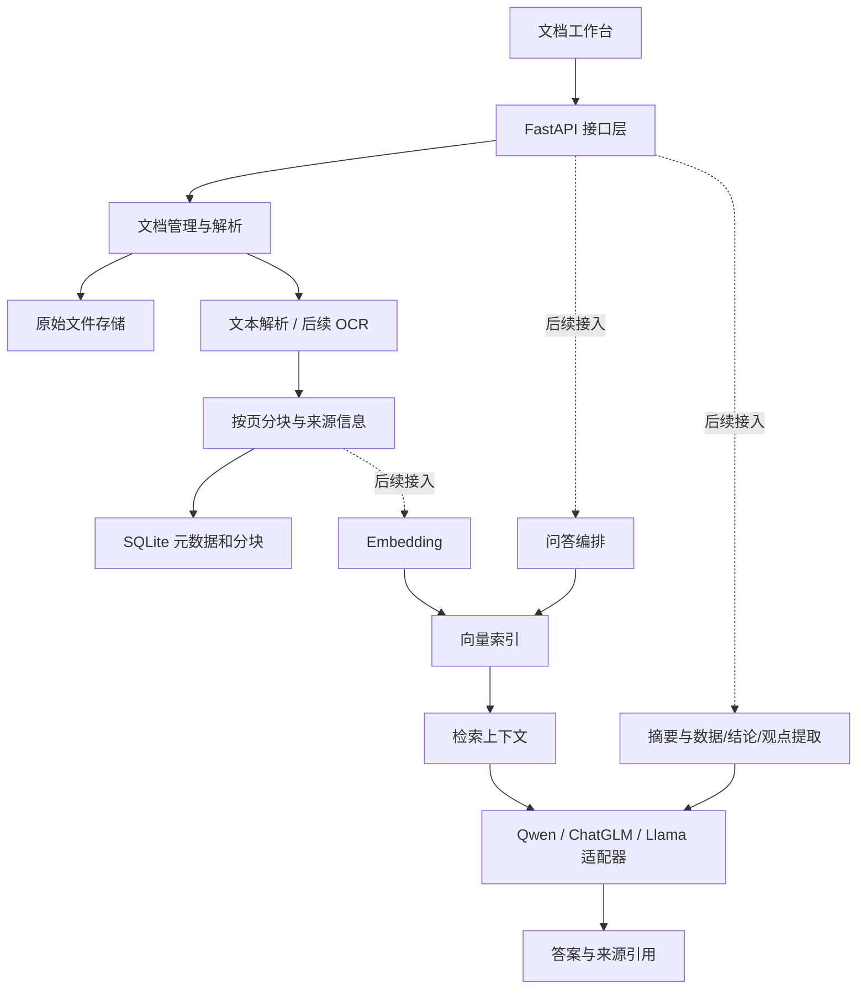

# 项目实施方案

## 后续接入记录：Embedding 网关

根据用户后续提供的示例，新增 `https://tokendance.space/gateway/v1` 的 `qwen3.7-text-embedding` 适配器，并使用独立 `EMBEDDING_API_KEY`。已实现批量向量化、结果校验、SQLite 向量持久化、索引状态与单文档原文检索，均附中文注释。索引由用户主动创建，不随上传自动发送原文。真实网关连通性需配置密钥后验证；RAG 答案生成与引用校验仍是下一阶段任务。以下初始阶段表保留作为原始实施规划。

## 后续接入记录：DeepSeek API

用户在框架完成后选择使用在线 DeepSeek API。已新增 DeepSeek 模型适配器、`.env` 配置加载、配置状态查询和手动连接测试，采用 `deepseek-flash` 及用户示例中的思考参数。这是后续确定的实现选择，不是原始需求文档中指定的模型。真实连接需在本地填写 API Key 后验证；下述 OCR、Embedding、RAG、摘要与提取阶段仍待实施。

## 1. 需求边界

唯一需求来源为根目录《智能文档分析与知识问答系统.md》。该文档描述目标和核心能力，没有指定交付周期、技术版本、模型部署方式、数据规模、用户权限或效果指标。以下技术选型和阶段划分是实施建议，不是原文额外要求。本次交付止于基础框架和可验证的文档处理流程。

| 原文内容 | 工程模块 | 本阶段交付 | 后续工作 |
| --- | --- | --- | --- |
| PDF、学术论文及非结构化资料 | 文档接入与存储 | PDF/TXT 上传、文档元数据、本地文件存储 | 依据真实样本扩展格式与论文结构识别 |
| 文档自动解析 | 解析与预处理 | 文本层解析、页码、分块、状态与错误 | 上传后后台自动解析、标题/段落/表格结构 |
| OCR 识别 | OCR 适配层 | 独立协议与缺失能力提示 | 页面渲染、识别、坐标与置信度、混合 PDF |
| Embedding 向量化 | 向量索引层 | Embedding 与向量存储协议 | 模型选型、批量向量化、索引写入与版本管理 |
| RAG 检索增强、上下文精准问答 | 检索与问答层 | API 和带来源的回答结构 | 查询向量化、文档范围过滤、召回、上下文组装、生成 |
| 智能摘要 | 分析层 | 摘要入口和返回结构 | 分块摘要、汇总、来源绑定 |
| 数据/结论/观点自动提取 | 信息提取层 | 三类提取结果结构与入口 | 结构化生成、结果校验、来源绑定 |
| Qwen、ChatGLM、Llama | 模型适配层 | 共用 LanguageModel 协议 | 按实际部署端点分别实现适配器和配置 |

## 2. 技术选型与分层

采用 Python + FastAPI 承载解析与 API，SQLite 保存文档和文本分块，本地文件目录存原件，HTML/CSS/JavaScript 提供轻量工作台。选择这些组件是为了减少基础框架启动依赖，后续可按规模替换存储和前端。pypdf 用于读取 PDF 文本层，不承担 OCR。

实线表达模块数据关系，虚线表示当前尚未实现的接入路径。模型只通过统一接口调用，避免业务路由绑定某一家模型。OCR 和 Embedding 是不同职责，不应与生成模型适配器混在一起。

## 3. 数据与接口

文档记录包含 ID、原文件名、字节数、时间、解析状态、页数、块数、错误信息。原件采用服务端生成的 ID 存储。文本块包含独立 ID、文档 ID、页码与正文，未来向量记录需要绑定同一块 ID。TXT 作为单个逻辑页处理。

当前状态流转：`uploaded → parsing → parsed / failed`；失败可重试。`parsed` 仅表示文本已解析，未来索引层应另设 `pending / indexing / indexed / failed` 状态，不能混用。

| 接口 | 职责 | 当前状态 |
| --- | --- | --- |
| GET /api/health | 服务健康 | 可用 |
| GET /api/capabilities | 能力接入状态 | 可用 |
| POST /api/documents | 上传资料 | 可用 |
| GET /api/documents | 文档列表 | 可用 |
| GET /api/documents/{id} | 元数据与状态 | 可用 |
| POST /api/documents/{id}/parse | 解析与分块 | 可用 |
| GET /api/documents/{id}/chunks | 来源文本 | 可用 |
| POST /api/documents/{id}/summary | 智能摘要 | 已定义契约，未接模型 |
| POST /api/documents/{id}/extract | 提取数据/结论/观点 | 已定义契约，未接模型 |
| POST /api/documents/{id}/questions | 上下文问答 | 已定义契约，未接模型 |

后续模型输出必须通过响应结构校验；引用须指向真实存在的块与页码，不能直接信任模型生成的引用编号。资料内容应被当作待分析数据，与系统指令隔离。检索不足时明确回答缺少依据。

## 4. 推荐实施顺序

### 第一阶段：基础框架（本次）

搭建工作台、API、存储、解析、分块及外部能力协议。验收：应用可启动，上传与解析闭环可用，数据可跨重启保存，失败可见，尚未接入能力没有伪造结果。

### 第二阶段：完善文档处理

以真实 PDF、论文和扫描件组成样本集，接入 OCR，保留页码和布局位置，完善段落、表格和标题处理。增加后台任务，上传后自动启动解析，并可查询进度。验收：文本 PDF、扫描 PDF、混合 PDF 都能解析；空白页策略明确；失败任务可重试且不重复写块。

### 第三阶段：完成 RAG 问答闭环

先实现一个生成模型适配器、一种 Embedding 和一种向量存储；具体选型依据实际部署条件。完成分块向量化、文档范围过滤、检索、上下文预算、模型生成及引用校验，再接入另外两种模型。验收：文档内事实问答可追溯，跨文档隔离有效，无依据问题有清晰反馈；记录耗时与检索来源。

### 第四阶段：摘要与信息提取

复用模型适配层，长文档采用分块处理和汇总，分别输出数据、结论、观点并校验引用。验收：摘要覆盖主要内容；抽取项类型明确；数字与原文一致；不将模型猜测当作原文结论。

### 第五阶段：效果评估与交付

建立固定评估样本，检查解析质量、检索命中、回答依据、摘要覆盖、提取准确性、延迟和失败率。原文没有给定数值指标，先建立基线再确定验收阈值。依据使用规模决定任务队列、数据库迁移、权限与部署方案。

## 5. 下一阶段需要确定的信息

真实文档样本及语言、扫描件比例、表格复杂度、单文件大小和页数；模型采用本地部署还是远程 API；可用算力和存储；预期并发和响应时延。这些信息影响后续实现，不阻碍当前基础框架。
